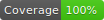

# Time Storage


[](https://circleci.com/gh/WendellAdriel/time-storage/tree/master)
[](https://github.com/WendellAdriel/time-storage/blob/master/LICENSE)

[](#contributors)

[![version][version-badge]][package]
[![downloads][downloads-badge]][npmcharts]
[![size][size-badge]][unpkg-dist] [![gzip size][gzip-badge]][unpkg-dist]

[![Watch on GitHub][github-watch-badge]][github-watch]
[![Star on GitHub][github-star-badge]][github-star]
[![Tweet][twitter-badge]][twitter]

Small library to work with the local storage implementing lifetime for its items

## How to use

Install the package

```
yarn add time-storage
```

Import it and create your time storage

```js
import TimeStorage from "time-storage";

const myStorage = TimeStorage("my_storage");
```

And that's it!!!
Check the **API Reference** below to check all that you can do with this package.

## API Reference

#### Creating a new storage

When creating a new Time Storage, you need to give it a **namespace** and you can optionally pass a default validity for the items in that storage. If you don't pass a default validity, the items in that storage will be valid for **30 minutes** since it was stored. You can create as many storages as you want.

```js
import TimeStorage from "time-storage";

// This storage has the 'my_storage' namespace
// The items will have a default lifetime of 30 minutes
const myStorage = TimeStorage("my_storage");

// This storage has the 'my_second_storage' namespace
// The items will have a default lifetime of 60 minutes
const mySecondStorage = TimeStorage("my_second_storage", 60);

// This storage has the 'my_third_storage' namespace
// The items will have a default lifetime of 3 hours
// You can pass 'minute', 'hour' or 'day' as the time unit
const myThirdStorage = TimeStorage("my_third_storage", 3, "hour");
```

#### get(key: String, defaultValue: any _[default: null]_): any

Checks if the Time Storage has the item for the given key and returns if the item is found and if it's still valid, otherwise returns the `defaultValue`

```js
import TimeStorage from "time-storage";

const myStorage = TimeStorage("my_storage");

// If the storage doesn't have this item, it will return null
myStorage.get("key");

// If the storage doesn't have this item, it will return 'default'
myStorage.get("key", "default");
```

#### getAll(): Object

Returns an object with all the valid items for the Time Storage

```js
import TimeStorage from "time-storage";

const myStorage = TimeStorage("my_storage");

// Returns an object in the following format: { first_key: first_value, second_key: second_value }
myStorage.getAll();
```

#### set(key: String, value: any, validFor: Number _[default: Storage default validity]_, timeUnit: String, _[default: Storage default time unit]_)

Sets an item on the Time Storage with the given key. If `validFor` is given, this value will be used instead of the default validity of the Time Storage. If `timeUnit` is given, this unit will be used instead of the default validity of the Time Storage.

```js
import TimeStorage from "time-storage";

// This storage has the 'my_storage' namespace
// The items will have a default lifetime of 30 minutes
const myStorage = TimeStorage("my_storage");

// This item will be set with the default validity for this storage: 30 minutes
myStorage.set("my_key", { message: "Hello, world" });

// This item will be set and will be valid for 60 minues
myStorage.set("second_key", 1000, 60);

// This item will be set and will be valid for 3 hours
myStorage.set("third_key", "my_data", 3, "hour");
```

#### remove(key: String)

Removes an item from the Time Storage. You can have items with the same key in different Time Storages. This is possible using different namespaces for your Time Storages. If you have items with the same key on Time Storages with different namespaces, the `remove()` function will remove the item only on the Time Storage that you called it.

```js
import TimeStorage from "time-storage";

const myStorage = TimeStorage("my_storage");

myStorage.set("my_key", { message: "Hello, world" });

// Removes the item with the key 'my_key' from this Time Storage
myStorage.remove("my_key");
```

#### clear()

Removes all items from the Time Storage. This will not affect Time Storages with different namespaces.

```js
import TimeStorage from "time-storage";

const myStorage = TimeStorage("my_storage");

myStorage.set("my_key", { message: "Hello, world" });
myStorage.set("second_key", 1000, 60);

// Removes all the items from this storage
myStorage.clear();
```

## Contributors

Thanks goes to these wonderful people ([emoji key](https://github.com/kentcdodds/all-contributors#emoji-key)):

<!-- ALL-CONTRIBUTORS-LIST:START - Do not remove or modify this section -->
<!-- prettier-ignore -->
| [<br /><sub><b>Wendell Adriel</b></sub>](https://wendelladriel.com)<br />[💻](https://github.com/WendellAdriel/time-storage/commits?author=WendellAdriel "Code") [📖](https://github.com/WendellAdriel/time-storage/commits?author=WendellAdriel "Documentation") [🤔](#ideas-WendellAdriel "Ideas, Planning, & Feedback") [🚇](#infra-WendellAdriel "Infrastructure (Hosting, Build-Tools, etc)") [⚠️](https://github.com/WendellAdriel/time-storage/commits?author=WendellAdriel "Tests") |
| :---: |

<!-- ALL-CONTRIBUTORS-LIST:END -->

This project follows the [all-contributors](https://github.com/kentcdodds/all-contributors) specification. Contributions of any kind welcome!

[downloads-badge]: https://img.shields.io/npm/dm/time-storage.svg?style=flat-square
[npmcharts]: http://npmcharts.com/compare/time-storage
[version-badge]: https://img.shields.io/npm/v/time-storage.svg?style=flat-square
[package]: https://www.npmjs.com/package/time-storage
[size-badge]: http://img.badgesize.io/https://unpkg.com/time-storage/dist/time-storage.js?style=flat-square&label=size
[unpkg-dist]: https://unpkg.com/time-storage/dist/
[gzip-badge]: http://img.badgesize.io/https://unpkg.com/time-storage/dist/time-storage.js?label=gzip%20size&style=flat-square&compression=gzip
[github-watch-badge]: https://img.shields.io/github/watchers/WendellAdriel/time-storage.svg?style=social
[github-watch]: https://github.com/WendellAdriel/time-storage/watchers
[github-star-badge]: https://img.shields.io/github/stars/WendellAdriel/time-storage.svg?style=social
[github-star]: https://github.com/WendellAdriel/time-storage/stargazers
[twitter]: https://twitter.com/intent/tweet?text=Check%20out%20time-storage!%20https://github.com/WendellAdriel/time-storage%20%F0%9F%91%8D
[twitter-badge]: https://img.shields.io/twitter/url/https/github.com/WendellAdriel/time-storage.svg?style=social
